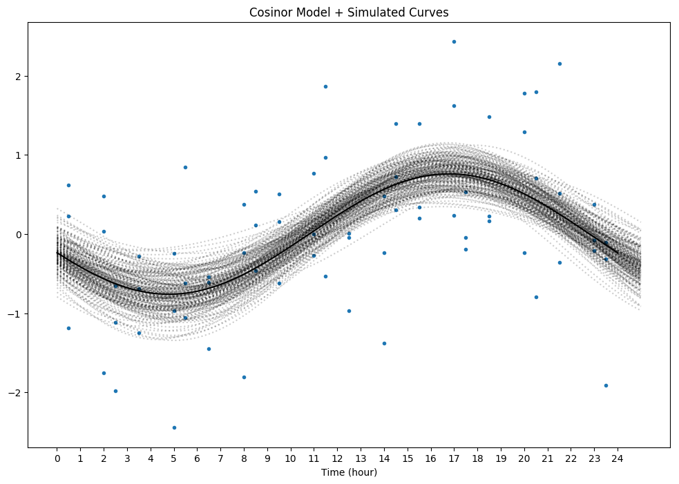
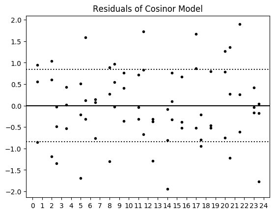
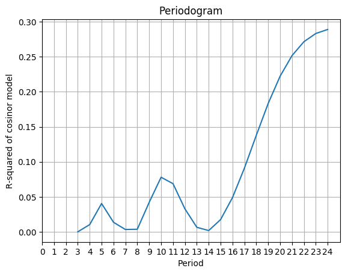
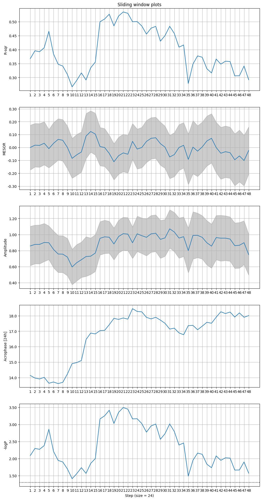

# simcosinor
[](https://travis-ci.org/trislett/simcosinor)

Simulations for the cosinor model.

#### Lazy install
```
virtualenv -p python3.7 python37env
source python37env/bin/activate
git clone https://github.com/trislett/simcosinor.git
cd simcosinor
pip install .
cd ..
```

#### Some examples

Just run 10000 simulations using the defaults: 
```
simcosinor
```

Run the simulations using 24 random times points only.

```
simcosinor -rand -ns 24
```

Run the simulations with eveningly dispursed time-points, but limited from 11:30am until 11:30pm.

```
simcosinor -rand -ns 72 -sr 11.5 23.5 -er
```

Run the simulations with randomly dispursed time-points.

```
simcosinor -rand -ns 72 -sr 0 24
```

### Plotting examples

Run simulation and generate plots of the right insula gyrus

```
simcosinor -rand -ps -pp -pw 24 -roi rh.R_Ig
```

Console output:

```
Running 10000 simulations...
[Metric]	[Mean] [Standard Deviation]
R2	=	0.3061 [0.0841]
Acro24	=	16.7937 [0.7331]
-logP	=	12.8657 [4.2723]
```

Simulation plot:



Residual plot of the cosinor model (used to estimate the error):



Periodogram:




Sliding window (size = 24):



